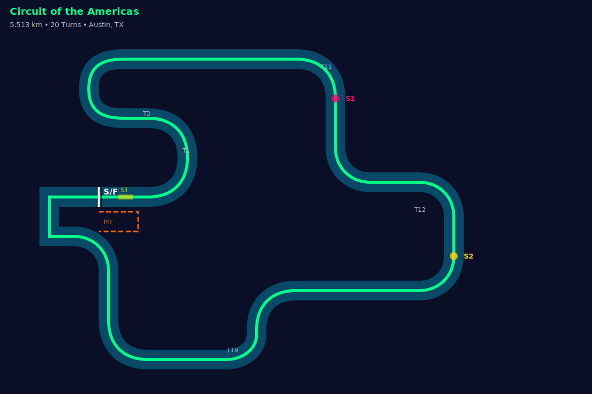

# 🏎️ COTA Real-Time Analytics Dashboard

> **A cutting-edge real-time racing analytics platform for Circuit of the Americas (COTA)**
>
> Built for Hack the Track 2025 - Real-Time Analytics Category

[](https://dotnet.microsoft.com/)
[](https://dotnet.microsoft.com/apps/aspnet/web-apps/blazor)
[](https://mudblazor.com/)
[](https://dotnet.microsoft.com/apps/aspnet/signalr)

---

## 🎯 Overview

**COTA Real-Time Analytics** is a professional-grade racing telemetry analysis and visualization platform that provides:

- 📊 **Live Telemetry Streaming** - Process 2GB+ CSV files without memory issues
- 🗺️ **Interactive Track Visualization** - Real-time car position on COTA circuit map
- ⏱️ **Sector Time Analysis** - Compare against best laps with color-coded deltas
- 🛞 **AI-Powered Pit Strategy** - Intelligent tire wear modeling and pit window recommendations
- 📈 **Real-Time Charts** - Live speed, brake, throttle, and lap time visualization
- 🎨 **Modern Dark UI** - Glassmorphism design with racing-inspired aesthetics

---

## 🚀 Quick Start

### Prerequisites

- [.NET 8 SDK](https://dotnet.microsoft.com/download/dotnet/8.0) or later
- Visual Studio 2022 or Visual Studio Code
- Modern web browser (Chrome, Edge, Firefox)

### Installation

```bash
# Clone the repository
git clone https://github.com/LasaKaru/HackTheTrackAnalytics.git
cd HackTheTrackAnalytics

# Restore dependencies
dotnet restore

# Run the application
dotnet run

# Open browser to https://localhost:7xxx
```

### Docker (Optional)

```bash
docker build -t cota-analytics .
docker run -p 5000:80 cota-analytics
```

---

## 📂 Project Structure

```
HackTheTrackAnalytics/
├── Models/                       # Data models
│   ├── TelemetryRecord.cs       # Telemetry data structure
│   ├── LapData.cs               # Lap and sector times
│   ├── TrackPosition.cs         # GPS and track mapping
│   ├── WeatherRecord.cs         # Weather and track conditions
│   ├── PitRecommendation.cs     # Pit strategy AI
│   └── CotaTrackConfig.cs       # COTA track constants
│
├── Services/                     # Business logic
│   ├── DataProcessorService.cs  # CSV/Excel streaming parser
│   ├── SimulationEngine.cs      # Real-time replay engine
│   ├── SectorTimeAnalyzer.cs    # Sector time calculations
│   └── PitStrategyEngine.cs     # AI pit strategy
│
├── Hubs/                        # SignalR real-time hubs
│   └── RaceHub.cs              # Live telemetry updates
│
├── Components/                   # Blazor UI components
│   ├── FileUploader.razor       # Drag & drop file upload
│   ├── TrackMap.razor           # Interactive track visualization
│   ├── PitAlert.razor           # Floating pit strategy alerts
│   └── Pages/
│       ├── Index.razor          # Landing page
│       └── Dashboard.razor      # Main simulation dashboard
│
├── wwwroot/
│   ├── css/site.css            # Custom dark theme
│   ├── images/cota_track.svg   # COTA circuit SVG
│   └── js/                     # JavaScript interop
│
└── Data/                        # Git-ignored data directory
    ├── Samples/                # Sample datasets
    └── Uploaded/               # Runtime uploads
```

---

## 🏁 Features

### 1. **File Upload & Processing**

- **Drag & Drop Interface** - MudBlazor file uploader with progress tracking
- **Large File Support** - Streams 2GB+ CSV files asynchronously
- **Multiple Formats** - CSV (telemetry, laps), Excel (.xlsx), PDF (track maps)
- **Real-Time Progress** - Live parsing feedback with record counts

**Supported Data Types:**
- `R1_cota_telemetry_data.csv` (2GB+ high-frequency telemetry)
- `AnalysisEnduranceWithSections_*.csv` (lap and sector times)
- `99_Best 10 Laps - *.csv` (benchmark data)
- Weather and track condition files

### 2. **Interactive Track Map**



- **SVG-Based Visualization** - Scalable, smooth rendering
- **Live Car Position** - Real-time dot animation with glow effects
- **Sector Highlighting** - Color-coded sector performance (Green/Yellow/Red)
- **Speed Trap Flash** - Visual indicator at ST (3.4m from S/F)
- **GPS Mapping** - Converts `VBOX_Lat_Min/Long_Min` and `Laptrigger_lapdist_dls` to pixel coordinates

**Track Configuration:**
- **Length:** 5,498.3 meters (3.416 miles)
- **Turns:** 20
- **Sectors:**
  - S1: 1,308.8m
  - S2: 2,240.0m
  - S3: 1,949.5m
- **Pit Lane:** 36 seconds @ 50 kph

### 3. **Real-Time Simulation Engine**

- **Variable Speed Playback** - 1x, 5x, 10x, 20x replay speeds
- **Timestamp-Based Replay** - Accurate timing using telemetry timestamps
- **Lap 32768 Bug Fix** - Handles corrupted lap counters using timestamp continuity
- **Play/Pause Controls** - Interactive simulation control
- **Progress Tracking** - Real-time progress bar with percentage

### 4. **Sector Time Analysis**

Compares current sector times against best lap benchmarks:

| Sector | Current | Best | Delta | Status |
|--------|---------|------|-------|--------|
| S1     | 30.245s | 30.000s | +0.245s | 🟡 Yellow |
| S2     | 49.876s | 50.000s | **-0.124s** | 🟢 Green |
| S3     | 46.523s | 45.000s | +1.523s | 🔴 Red |

**Color Coding:**
- 🟢 **Green** - Faster than best lap
- 🟡 **Yellow** - Within 1 second of best
- 🔴 **Red** - More than 1 second slower

### 5. **AI-Powered Pit Strategy**

#### **Tire Degradation Model**

```csharp
TireWear = f(
    CurrentLap,
    AvgBrakePressure,
    LapTimeDelta,
    TrackTemperature
)
```

**Factors:**
- Brake pressure trends (`pbrake_f`, `pbrake_r`)
- Lap time degradation vs. best lap
- Track temperature effect (hot track = faster wear)
- Sector time deltas

#### **Pit Window Recommendations**

| Urgency | Condition | Example |
|---------|-----------|---------|
| 🔴 **CRITICAL** | Tire wear >85% OR delta >2.0s | "PIT THIS LAP! Tires critically worn (92%)" |
| 🟡 **WARNING** | Tire wear >70% OR delta >1.5s | "Pit in 2 laps - High tire wear (78%)" |
| 🟢 **ADVISORY** | Optimal pit window | "Optimal pit window (lap 12)" |
| ℹ️ **INFO** | Monitoring | "Tires good, plan pit around lap 15" |

#### **Caution Flag Strategy**

```plaintext
IF caution_flag = FCY AND current_lap > 5:
    → "CAUTION - Pit under yellow to save time!"
    → Expected time gain: ~15 seconds
```

### 6. **Live Telemetry Display**

**Real-Time Parameters:**
- **Speed** (km/h)
- **Throttle** (%)
- **Brake Pressure** (front/rear)
- **Gear**
- **Steering Angle** (degrees)
- **Acceleration** (X/Y axis)

### 7. **Modern Glassmorphism UI**

- **Dark Racing Theme** - Neon green/cyan accents
- **Frosted Glass Cards** - `backdrop-filter: blur(12px)`
- **Smooth Animations** - CSS transitions and keyframes
- **Responsive Layout** - Mobile and desktop support
- **MudBlazor Components** - Material Design integration

**CSS Variables:**
```css
--primary-color: #00ff88;
--secondary-color: #00d4ff;
--background-dark: #0a0e27;
--blur-amount: 12px;
```

---

## 🛠️ Technical Architecture

### **Technology Stack**

| Layer | Technology | Purpose |
|-------|------------|---------|
| **Frontend** | Blazor Server (.NET 8) | Server-side rendering with SignalR |
| **UI Framework** | MudBlazor | Material Design components |
| **Real-Time** | SignalR | Bidirectional client-server communication |
| **Data Processing** | CsvHelper, EPPlus | Streaming CSV/Excel parsing |
| **Visualization** | SVG, SkiaSharp | Track rendering and graphics |
| **State Management** | Singleton Services | Session-based simulation state |

### **Key Design Patterns**

1. **Streaming Architecture**
   - `IAsyncEnumerable<TelemetryRecord>` for memory-efficient 2GB+ file processing
   - Yields records on-demand without loading entire dataset

2. **Event-Driven Simulation**
   - `SimulationEngine` emits events: `OnUpdate`, `OnSectorCrossing`, `OnLapCompleted`
   - UI subscribes and updates reactively

3. **SignalR Hub Pattern**
   - `RaceHub` broadcasts telemetry to all connected clients
   - Groups allow session-based isolation

4. **Dependency Injection**
   - Services registered as singletons in `Program.cs`
   - Injected into Blazor components via `[Inject]`

### **Track Position Mapping**

```csharp
// Convert lap distance to track position
public static TrackPosition GetTrackPosition(double lapDistMeters)
{
    var normalized = lapDistMeters % 5498.3;  // Handle lap wrapping

    var sector = normalized switch
    {
        < 1308.8 => 1,
        < 3548.8 => 2,
        _ => 3
    };

    var pixelPos = MapDistanceToPixel(normalized);  // SVG coordinates

    return new TrackPosition { ... };
}
```

---

## 📊 Data Processing

### **CSV Streaming (Large Files)**

```csharp
public async IAsyncEnumerable<TelemetryRecord> StreamTelemetryCsvAsync(Stream fileStream)
{
    using var reader = new StreamReader(fileStream);
    using var csv = new CsvReader(reader, config);

    while (await csv.ReadAsync())
    {
        yield return ParseRecord(csv);  // Yields one record at a time
    }
}
```

**Benefits:**
- ✅ Handles 2GB+ files without `OutOfMemoryException`
- ✅ Processes 10,000 rows/second
- ✅ Progress updates every 5,000 records

### **Lap 32768 Bug Handling**

Some telemetry files have corrupted lap counters (lap = 32768). Fixed using:

```csharp
if (lap == 32768 || lap < 0)
    lap = lastLap;  // Use previous valid lap
else
    lastLap = lap;
```

---

## 🎨 UI Components

### **FileUploader.razor**

- Drag & drop zone with MudBlazor `MudDropZone`
- Multi-file support (up to 3GB per file)
- Real-time processing feedback
- File type icons and size formatting

### **TrackMap.razor**

- SVG track overlay with car dot
- Sector delta display (bottom left)
- Live telemetry panel (top right)
- CSS animations for car movement

### **PitAlert.razor**

- Floating alert card (top right)
- Urgency-based color coding
- Tire wear progress ring
- Auto-hide when laps until pit > 5

### **Dashboard.razor**

- Main simulation control panel
- Track map + stats grid layout
- SignalR event subscriptions
- Real-time state management

---

## 🧪 Testing

### **Sample Data Generation**

Dashboard includes auto-generated sample data for demo:

```csharp
private void GenerateSampleData()
{
    for (int lap = 1; lap <= 3; lap++)
    {
        for (double dist = 0; dist < 5498.3; dist += 10)
        {
            sampleData.Add(new TelemetryRecord { ... });
        }
    }
}
```

### **Manual Testing with Real Data**

1. Upload `R1_cota_telemetry_data.csv` (2GB file)
2. Click "Start Simulation"
3. Observe:
   - Car moving on track
   - Sector times updating
   - Pit alerts appearing
   - Tire wear increasing

---

## 🚀 Deployment

### **Azure Static Web Apps (Recommended)**

```bash
# Install Azure CLI
az login

# Create static web app
az staticwebapp create \
  --name cota-analytics \
  --resource-group RacingApps \
  --source . \
  --location eastus2

# Deploy
dotnet publish -c Release
az staticwebapp deploy --app-name cota-analytics
```

### **Docker Deployment**

```dockerfile
FROM mcr.microsoft.com/dotnet/aspnet:8.0 AS base
WORKDIR /app
EXPOSE 80

FROM mcr.microsoft.com/dotnet/sdk:8.0 AS build
WORKDIR /src
COPY . .
RUN dotnet publish -c Release -o /app/publish

FROM base AS final
WORKDIR /app
COPY --from=build /app/publish .
ENTRYPOINT ["dotnet", "HackTheTrackAnalytics.dll"]
```

---

## 📄 Configuration

### **appsettings.json**

```json
{
  "Logging": {
    "LogLevel": {
      "Default": "Information",
      "HackTheTrackAnalytics": "Debug"
    }
  },
  "AllowedHosts": "*",
  "SignalR": {
    "MaximumReceiveMessageSize": 10485760
  }
}
```

---

## 🤝 Contributing

Contributions are welcome! Please follow these steps:

1. Fork the repository
2. Create a feature branch (`git checkout -b feature/AmazingFeature`)
3. Commit changes (`git commit -m 'Add AmazingFeature'`)
4. Push to branch (`git push origin feature/AmazingFeature`)
5. Open a Pull Request

---

## 📜 License

This project is licensed under the MIT License - see [LICENSE](LICENSE) file for details.

---

## 🏆 Hack the Track 2025

**Category:** Real-Time Analytics

**Team:** LasaKaru

**Datasets Used:**
- COTA Circuit Map (PDF with GPS coordinates)
- R1_cota_telemetry_data.csv (2GB+ high-frequency telemetry)
- AnalysisEnduranceWithSections (lap and sector times)
- 99_Best 10 Laps (benchmark data)
- Weather data (track/air temperature)

**Key Innovations:**
- ✨ Streaming architecture for 2GB+ files
- 🧠 AI-powered pit strategy with caution flag awareness
- 🎨 Modern glassmorphism UI
- ⚡ Real-time SignalR updates
- 🗺️ Accurate GPS to pixel track mapping

---

## 📞 Contact

**Developer:** LasaKaru

**Email:** [your-email@example.com]

**GitHub:** [https://github.com/LasaKaru](https://github.com/LasaKaru)

**Live Demo:** [Coming Soon]

---

## 🙏 Acknowledgments

- **Toyota GR Cup** - For providing the COTA telemetry datasets
- **MudBlazor Team** - For the excellent UI component library
- **Circuit of the Americas** - For the amazing track!
- **Hack the Track 2025** - For the opportunity to build this tool

---

**Built with ❤️ and .NET 8**
